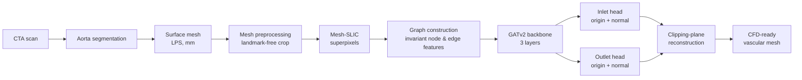

# AortaClip

GATv2-based prediction of inlet (aortic annulus) and outlet (brachiocephalic artery) clipping planes directly from a segmented aortic surface mesh, for patient-specific TAVI CFD preprocessing. The model predicts each plane's **origin and normal** end-to-end; both are equivariant functions of the mesh geometry, so no plane is hand-built after the fact.

## Authors

Khushi Hiremath¹˒³, Emil Gasimov¹, Fuyu Cheng⁵, Elisa Rauseo³, Yousaf Bhatti²˒⁴, Hsu Hlaing Hnin¹˒³, Vandhanaa Natrajan¹˒⁶, Caroline Roney¹˒⁵, Anthony Mathur²˒⁴, Gregory Slabaugh¹, Laura Bevis¹˒²˒⁵˒†, Xu Chen¹˒²˒†

<sub>¹ Digital Environment Research Institute, Queen Mary University of London, UK · ² William Harvey Research Institute, QMUL · ³ School of Physical & Chemical Sciences, QMUL · ⁴ Barts Heart Centre, QMUL · ⁵ School of Engineering & Materials Science, QMUL · ⁶ School of Electronic Engineering & Computer Science, QMUL · † Joint senior authors</sub>

<p align="center">
  
</p>

## Pipeline



## Model (`gnn_model.py`)

`ClipPlaneGATv2`:

- **Backbone** — 3 × `GATv2Conv` over `(x, edge_index, edge_attr)` (4 heads, `concat=False`) → per-node embeddings.
- **Context** — global mean + max pool → a patient vector, used *only* as extra input to the node-scoring MLPs (never as a coordinate source).
- **Two heads** (inlet, outlet), each equivariant:
  - `origin = Σ softmax(scoreᵢ) · posᵢ` — soft-argmax over patch centroids.
  - `normal` = smallest eigenvector of the score-weighted covariance of the patch **wall normals** (the vessel axis).
- **Loss** (`plane_loss`) — smooth-L1 on origins + sign-invariant `1 − |cos|` on normals + a Gaussian heatmap cross-entropy that peaks each head's attention at the true origin. Weights: `normal_weight=10`, `heatmap_weight=1`, `sigma=10 mm`.

Everything runs in the **centered frame** (`Data.pos` is mesh-centered); add `Data.center` back to recover LPS/mm.

## Repository layout

```
gnn_model.py          # ClipPlaneGATv2, PlaneHead, plane_loss
train_loocv.py        # dataset loading + leave-one-out CV (shared utils live here)
train_final.py        # fixed train/test split (5 held-out patients)
run_graph.py          # [required, not shown] builds results/graphs/*_slic_mesh.npz
make_ground_truth.py  # [required, not shown] builds results/ground_truth/*_gt.json
infer_clip.py         # [required, not shown] clips test meshes with a saved model
assets/               # figures used in this README
```

## Requirements

- Python 3.9+, PyTorch, PyTorch Geometric, NumPy

```bash
pip install torch torch_geometric numpy
```

## Data layout

```
results/graphs/          <tag>_slic_mesh.npz
results/ground_truth/    <tag>_gt.json
results/gnn/             # model checkpoints + results (created by training)
```

**`<tag>_slic_mesh.npz`** (from `run_graph.py`) — keys:
`x` (N×5 invariant node features), `sp_centroids` (N×3), `sp_normals` (N×3),
`edge_index` (E×2), `edge_attr` (E×3).

**`<tag>_gt.json`** (from `make_ground_truth.py`) — `{"y12": [...]}`, a 12-vector in
raw LPS mm: inlet origin (3), inlet normal (3), outlet origin (3), outlet normal (3).

Patient tags follow the pattern `R_<number>`.

## Usage

```bash
python run_graph.py           # 1. build superpixel graphs
python make_ground_truth.py   # 2. build ground-truth planes
python train_loocv.py         # 3a. leave-one-out cross-validation
#   or
python train_final.py         # 3b. fixed 5-patient held-out test split
python infer_clip.py          # 4. clip the held-out meshes with the saved model
```

- `train_loocv.py` reports per-fold and mean ± std inlet/outlet **origin (mm)** and **normal (deg)** errors, saves one checkpoint per fold, and writes `loocv_results.json`.
- `train_final.py` holds out `TEST_TAGS = [R_10, R_16, R_24, R_27, R_29]`, standardises features on the training pool only, and saves `results/gnn/final_model.pt` (weights + `x_mean`/`x_std` + test tags).

Corrupt annotations are dropped automatically: a patient whose landmark sits > `MAX_LANDMARK_DIST_MM` (60 mm) from the mesh is skipped.

## Hyperparameters (`train_loocv.py`)

| Setting | Value |
|---|---|
| GATv2 layers | 3 |
| Attention heads | 4 |
| Hidden dim | 64 |
| Epochs | 300 (early stop, patience 40) |
| Learning rate | 1e-3 |
| Weight decay | 1e-4 |
| Batch size | 4 |
| Heatmap sigma | 10 mm |


## Notes

- The LOOCV summary is the stable accuracy estimate; the 5-patient test error (`train_final.py`) is unbiased but noisy (n=5).
- To deploy on a brand-new patient, retrain on all patients (remove the test split).

## Acknowledgements

Trained on the Apocrita HPC cluster, Queen Mary University of London.
